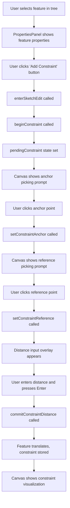

# Constraint Button Implementation Plan

## Overview
This plan details the implementation of a constraint button in the feature edit toolbox (PropertiesPanel) to provide an alternative entry point for the constraint workflow, complementing the existing keyboard shortcut (Cmd/Ctrl+D) and toolbar button.

## Current State Analysis

### Existing Constraint Implementation
The constraint system is already fully implemented with the following components:

1. **Constraint Solver** ([`src/sketch/constraintSolver.ts`](src/sketch/constraintSolver.ts))
   - `solveFeatureTranslation()` - Iterative least-squares solver for feature positioning
   - `propagateConstraintsOnTranslate()` - Handles constraint propagation when features move
   - Supports point-to-point and point-to-segment distance constraints

2. **Store Actions** ([`src/store/projectStore.ts`](src/store/projectStore.ts:4881))
   - `beginConstraint(featureId)` - Initiates constraint workflow
   - `setConstraintAnchor(anchor)` - Sets the anchor point on the feature
   - `setConstraintReference(reference)` - Sets the reference point/segment
   - `commitConstraintDistance(distance)` - Finalizes the constraint with a distance value
   - `cancelPendingConstraint()` - Cancels the workflow

3. **UI Integration**
   - **Canvas** ([`src/components/canvas/SketchCanvas.tsx`](src/components/canvas/SketchCanvas.tsx:210)): Full visual feedback with snap points, distance input overlay
   - **Toolbar** ([`src/components/layout/Toolbar.tsx`](src/components/layout/Toolbar.tsx:418)): `handleFeatureConstraint()` handler exists but is NOT exposed in any toolbar button group
   - **Keyboard**: Cmd/Ctrl+D shortcut triggers constraint mode

4. **Data Model** ([`src/types/project.ts`](src/types/project.ts:97))
   - `LocalConstraint` interface with support for `fixed_distance` type
   - Stores anchor point, reference point/segment, and distance value

### Current Workflow
1. User selects a feature
2. User presses Cmd/Ctrl+D (or would click constraint button)
3. Canvas prompts: "Click a snap point on this feature to set the anchor"
4. User clicks anchor point on selected feature
5. Canvas prompts: "Click a snap point on another feature to set the reference"
6. User clicks reference point on different feature
7. Distance input appears at midpoint between anchor and reference
8. User enters distance value and presses Enter
9. Feature translates to satisfy the constraint, and constraint is stored

### Gap Analysis
**Missing Component**: The constraint button is NOT present in the feature edit toolbox section of the PropertiesPanel.

The [`SketchEditActions`](src/components/layout/Toolbar.tsx:872) component in the Toolbar has:
- Add Point button
- Delete Point button  
- Fillet button
- **Constraint button** (with `onConstraint` prop and `constraintActive` state)

However, the PropertiesPanel feature edit section ([`src/components/feature-tree/PropertiesPanel.tsx`](src/components/feature-tree/PropertiesPanel.tsx:1244)) only has:
- "Edit Sketch" button
- "Delete Feature" button

## Implementation Plan

### Step 1: Add Constraint Button to PropertiesPanel

**File**: [`src/components/feature-tree/PropertiesPanel.tsx`](src/components/feature-tree/PropertiesPanel.tsx:1244)

**Location**: In the feature properties section, between the "Edit Sketch" button and "Delete Feature" button.

**Required Store Imports**:
```typescript
// Add to existing imports from useProjectStore
beginConstraint,
pendingConstraint,
cancelPendingConstraint,
```

**Button Implementation**:
```typescript
<button 
  className="feat-btn" 
  type="button" 
  onClick={() => {
    if (pendingConstraint) {
      cancelPendingConstraint()
      return
    }
    enterSketchEdit(selectedFeature.id)
    beginConstraint(selectedFeature.id)
  }}
  disabled={isTextFeature || selectedFeature.locked}
>
  {pendingConstraint ? 'Cancel Constraint' : 'Add Constraint'}
</button>
```

**Rationale**:
- Enters sketch edit mode first (like the toolbar does with `setSketchEditTool(null)`)
- Then begins constraint workflow
- Toggles between "Add Constraint" and "Cancel Constraint" based on `pendingConstraint` state
- Disabled for text features (cannot be edited) and locked features
- Uses existing `feat-btn` class for consistent styling

### Step 2: Visual Feedback Enhancement

**Constraint Badge Display**: The canvas already shows a badge with constraint count on features that have constraints ([`src/components/canvas/SketchCanvas.tsx`](src/components/canvas/SketchCanvas.tsx:682)).

**Active State**: The button label changes to "Cancel Constraint" when `pendingConstraint` is active, providing clear feedback.

### Step 3: Integration Points



### Step 4: Testing Checklist

- [ ] Button appears in PropertiesPanel when single feature is selected
- [ ] Button is disabled for text features
- [ ] Button is disabled for locked features
- [ ] Clicking button enters sketch edit mode
- [ ] Clicking button initiates constraint workflow
- [ ] Canvas shows correct prompts for anchor and reference picking
- [ ] Distance input appears after selecting reference
- [ ] Constraint is correctly stored in feature data
- [ ] Feature translates to satisfy constraint
- [ ] Constraint badge appears on feature with count
- [ ] Button label toggles to "Cancel Constraint" when active
- [ ] Clicking "Cancel Constraint" cancels the workflow
- [ ] Keyboard shortcut (Cmd/Ctrl+D) still works
- [ ] Multiple constraints can be added to same feature
- [ ] Constraints persist after save/load

### Step 5: Documentation Updates

**User-Facing Documentation**:
- Update any user guides to mention the constraint button in the properties panel
- Document the three ways to add constraints: keyboard shortcut, toolbar (if exposed), and properties panel button

**Developer Documentation**:
- Update [`ARCHITECTURE.md`](ARCHITECTURE.md) if needed to reflect constraint UI entry points
- Add comment in PropertiesPanel explaining the constraint button behavior

## Technical Notes

### Why Enter Sketch Edit Mode?
The constraint workflow requires the feature to be in sketch edit mode because:
1. It needs to highlight the feature's snap points
2. It needs to dim other features for visual clarity
3. The canvas interaction logic expects sketch edit context

### Constraint Storage
Constraints are stored in the feature's `sketch.constraints` array as `LocalConstraint` objects:
```typescript
{
  id: string
  type: 'fixed_distance'
  segment_ids: string[]  // Reference feature IDs
  value: number          // Distance value
  anchor_point: Point
  reference_point?: Point
  reference_segment?: { a: Point; b: Point }
}
```

### Constraint Propagation
When a feature with constraints is moved, the [`propagateConstraintsOnTranslate`](src/sketch/constraintSolver.ts:183) function:
1. Clears constraints on directly-moved features
2. Updates reference points/segments in dependent features
3. Re-solves dependent features to maintain their constraints
4. Handles transitive dependencies (features that depend on dependent features)

## Alternative Approaches Considered

### 1. Add to Toolbar SketchEditActions
**Pros**: Constraint button already exists in toolbar component
**Cons**: Only visible when feature is selected AND in sketch edit mode; less discoverable

### 2. Separate Constraints Section in PropertiesPanel
**Pros**: Could show list of existing constraints with edit/delete options
**Cons**: More complex UI; out of scope for current task

### 3. Context Menu Entry
**Pros**: Right-click workflow is familiar
**Cons**: Less discoverable than button; requires additional implementation

**Decision**: Implement button in PropertiesPanel for maximum discoverability and consistency with other feature edit actions.

## Success Criteria

1. ✅ Constraint button is visible in PropertiesPanel when single feature is selected
2. ✅ Button correctly initiates constraint workflow
3. ✅ Button integrates seamlessly with existing constraint system
4. ✅ Button styling matches existing PropertiesPanel buttons
5. ✅ Button state reflects active constraint workflow
6. ✅ All existing constraint functionality continues to work

## Files to Modify

1. [`src/components/feature-tree/PropertiesPanel.tsx`](src/components/feature-tree/PropertiesPanel.tsx)
   - Add `beginConstraint`, `pendingConstraint`, `cancelPendingConstraint` to store imports
   - Add constraint button in feature properties actions section
   - Wire up button click handler

## Estimated Complexity

**Low** - This is a straightforward UI integration task. The constraint system is fully implemented; we're just adding another entry point to trigger it.

## Next Steps

1. Switch to Code mode to implement the changes
2. Test the implementation thoroughly
3. Verify integration with existing constraint workflow
4. Update documentation if needed
