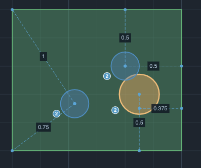
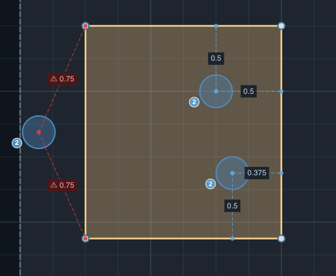
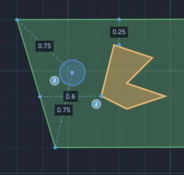
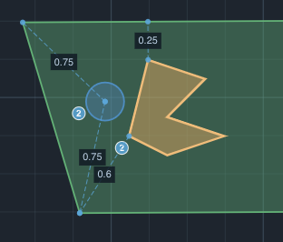
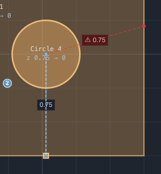

# Implementation Plan: Constraint Preservation & Semantic Anchors

## Objective
Enable parametric relationship preservation by transitioning from coordinate-based constraints to **Semantic Index-based** constraints. This allows features to maintain distances even when their references are moved or resized.

---

## 0. Prerequisites
Before beginning implementation, the agent must review the following:
- `ARCHITECTURE.md`: Foundational project architectural patterns and coding standards.
- `planning/CAM_App_Design.md`: Overall application design and state management context.
- `src/sketch/constraintSolver.ts`: Review current solver implementation to understand the existing `solveFeatureTranslation` and constraint handling logic.
- `src/types/project.ts`: Understand the current `LocalConstraint` and `Feature` definitions.

### 0. Other instructions
- As you are progressing with the code make sure it builds properly ```npm run build```
- Do not run ```npm run_dev``` I will do that
- Implement as many meaningful unit tests you can
- Update itemized trackable plan at the bottom of this document and update it as you progress
- You are expected to work independently
- If needed, make assumtions and document them here
- When finished ask user to do the testing, suggesting the test cases to do
- Have fun, be creative but follow the existing project structure and coding patterns

---

## 1. Data Model Requirements

Update `LocalConstraint` in `src/types/project.ts` to include semantic references. 

- **anchor_index**: `number`. Vertex index (for `'anchor'`) or Segment index (for `'midpoint'`).
- **anchor_type**: `'anchor' | 'midpoint'`.
- **reference_index**: `number`. Vertex index (for `'anchor'`) or Segment index (for `'midpoint' | 'segment'`).
- **reference_type**: `'anchor' | 'midpoint' | 'segment'`.
- **Special Index**: `-1` represents the **Natural Center** (geometric center of the shape).

```typescript
export interface LocalConstraint {
  id: string
  type: LocalConstraintType
  value: number // Required for persistence
  
  // Semantic References
  anchor_index: number
  anchor_type: 'anchor' | 'midpoint'
  reference_feature_id: string
  reference_index: number
  reference_type: 'anchor' | 'midpoint' | 'segment'
  
  // Metadata for UI/Validation
  is_invalid?: boolean
  error_message?: string
}
```

---

## 2. The Logic: "Contextual Preservation" Policy

The system must distinguish between editing the **Owner** (the feature that HAS the constraint) and the **Reference** (the feature the constraint POINTS to).

1.  **If the OWNER is moved/edited:**
    - Calculate the new distance based on the new geometry.
    - Update the constraint's `value` to match the new distance.
    - *Behavior:* Acts like a persistent dimension that "labels" the current distance.
2.  **If the REFERENCE is moved/edited:**
    - Keep the constraint's `value` constant.
    - Move the **Owner** feature to satisfy the original distance.
    - *Behavior:* Acts like a physical linkage/dependency.

---

## 3. Preservation & Invalidation Rules

### Preserve Constraint When:
1.  **Reference Movement:** The reference feature is moved, rotated, or resized. The owner must follow to maintain the `value`.
2.  **Owner Movement:** The owner feature is moved manually. The constraint `value` must be updated to reflect the new distance (Dimension behavior).
3.  **Shape Resizing:** A rectangle is resized, but the constraint is tied to a `Natural Center (-1)` or a `Midpoint`. The anchor point is re-calculated, and the owner follows.
4.  **Assembly Move:** Both the owner and reference are part of a multi-selection move.

### Invalidate or Drop Constraint When:
1.  **Deletion:** The reference feature is deleted. (Action: **Delete** constraint).
2.  **Structural Change:** The reference feature's profile is changed such that the `reference_index` is now out of bounds (e.g., Rectangle to Triangle). (Action: **Flag as Invalid**).
3.  **Conflict:** The solver cannot find a translation that satisfies all active constraints on a feature within a reasonable tolerance. (Action: **Flag as Invalid**).

---

## 4. Handling Broken/Impossible Constraints ("Soft Failure")

We will NOT delete constraints that become impossible to satisfy. Instead:
- **`is_invalid` Flag:** The `LocalConstraint` object will be marked `is_invalid: true`.
- **Visual Alert:** On the canvas, invalid constraints are rendered in **Red** with a warning icon next to the distance label.
- **Error Message:** Hovering over the invalid constraint shows the reason (e.g., "Reference index out of bounds" or "Conflicting constraints").
- **Repair Path:** The constraint remains in the system, allowing the user to either delete it manually or move the geometry back into a state where the constraint can be satisfied again.

---

## 5. Engineering Directives

### Task 1: Semantic Re-derivation
Implement `rederiveConstraintGeometry(owner, reference, constraint)` in `src/sketch/constraintSolver.ts`.
- **Natural Center (-1):** Use `calculateGeometricCenter(profile)`.
- **Midpoint:** Use `lerp(v[i], v[i+1], 0.5)`.
- **Segment:** Return the pair of points `{a, b}` for the indexed segment.

### Task 2: Propagation Engine
Implement `propagateConstraintsOnEdit(seedFeatureIds: string[])`.
- Perform a breadth-first traversal of the constraint graph starting from the edited seeds.
- For each dependent feature:
  1. Re-derive the target `anchor_point` and `reference_point/segment`.
  2. Use the **stored `value`** as the goal.
  3. Invoke `solveFeatureTranslation` to calculate the required `dx, dy`.
  4. Apply the translation to the dependent feature's profile.
  5. Repeat for its own dependents.

### Task 3: Integration with Store
Modify `projectStore.ts`:
- **`updateFeaturePoint`**: Call `propagateConstraintsOnEdit` for the edited feature.
- **`addConstraint`**: Automatically resolve and store `anchor_index` and `reference_index` by performing a hit-test on the current profile vertices/segments during placement.
- **`clearStaleConstraints`**: REMOVE the logic that deletes constraints on move. Instead, update the `value` (as per Policy #1).

### Task 5: UI & Interaction
- **Selection:** When a feature is selected, render its constraints as lines with labels on the canvas.
- **Editing:**
  - Clicking a constraint label opens a `DraftNumberInput`.
  - Committing a new value triggers the solver to move the feature immediately.
- **Deletion:**
  - Pressing `Delete` while a constraint line/label is selected removes it.
  - Add a "Constraints" list to the Feature Properties Panel with "X" delete buttons.

### Task 6: Validation
1. **Circle in Rectangle:** Constrain Circle Center (`-1`) to Rectangle Top Edge Midpoint (`midpoint`, index `0`). Resize the Rectangle by dragging the right edge. Verify: Circle "slides" to stay centered on the top edge.
2. **Rigid Move:** Move a Rectangle that a Circle is constrained to. Verify: Circle follows the Rectangle perfectly.
3. **Manual Override:** Drag the Circle away from its constrained position. Verify: Constraint distance value updates to the new manual distance.
4. **Soft Failure:** Delete the reference segment or cause an impossible conflict. Verify: Constraint turns Red and persists as `is_invalid`.

---

## 5. Implementation Sequence

1. **Phase 1 (Data Model):** Update `LocalConstraint` interface and store.
2. **Phase 2 (Solver Logic):** Implement `rederiveConstraintGeometry` and `propagateConstraintsOnEdit`.
3. **Phase 3 (Store Integration):** Update `updateFeaturePoint` to call the propagation engine.
4. **Phase 4 (UI):** Add canvas rendering for constraints and properties panel integration.
5. **Phase 5 (Testing):** Execute the validation scenarios outlined above.

---

## 6. Implementation Progress

### Assumptions Made
- Existing `anchor_point`/`reference_point`/`reference_segment` fields are kept as a coordinate cache; semantic fields are the source of truth when present. Legacy constraints (no semantic fields) continue to work via the cache.
- `reference_feature_id` mirrors `segment_ids[0]` for backward compatibility.
- Snap mode at constraint creation time determines semantic type: `'perpendicular'` → segment, `'center'` → anchor with index -1, `'midpoint'` → midpoint, otherwise nearest vertex.
- The `testOwnerMovedUpdatesValue` test simulates the store behavior (profile already moved before propagation is called), which is how `clearStaleConstraints` + `propagateConstraintsOnTranslate` interact in the store.

### Completed
- [x] **Phase 1:** `LocalConstraint` updated with `anchor_index`, `anchor_type`, `reference_feature_id`, `reference_index`, `reference_type`, `is_invalid`, `error_message`
- [x] **Phase 2:** `rederiveConstraintGeometry`, `refreshConstraintCache`, `calculateGeometricCenter`, `nearestVertexIndex`, `nearestSegmentIndex`, `inferSemanticIndices` implemented in `constraintSolver.ts`
- [x] **Phase 2:** `propagateRigidTransforms` updated to use semantic re-derivation for reference geometry; refreshes constraint caches after applying transforms
- [x] **Phase 3:** `clearStaleConstraints` replaced — now updates constraint `value` when owner is moved (Policy #1) instead of deleting
- [x] **Phase 3:** `commitConstraintDistance` stores semantic indices via `inferSemanticIndices`
- [x] **Phase 3:** `deleteFeatures` marks constraints referencing deleted features as `is_invalid: true` (soft failure, Policy: Delete → Flag)
- [x] **Phase 3:** `deleteConstraint(featureId, constraintId)` action added to store and types
- [x] **Phase 4:** Canvas renders invalid constraints in red with ⚠ prefix on label
- [x] **Phase 4:** PropertiesPanel shows Constraints list with delete buttons and invalid state styling
- [x] **Phase 5:** 4 new unit tests added: `testSemanticRederivation`, `testSemanticPropagation`, `testSemanticInvalidation`, `testOwnerMovedUpdatesValue` — all 11 tests pass


## Issues: 

1. ~~constrints to perpendicular can be created but they do not show in the sketch, they show in the feature properties. whn I load old test project with this type of constrint they show in sketch but new ones do not show~~ **FIXED**: `commitConstraintDistance` was storing `reference_point: undefined` for segment constraints. Now computes the foot-of-perpendicular as `reference_point`. `rederiveConstraintGeometry` also now returns the foot as `referencePoint` for segment constraints.
2. ~~cannot edit a constraint (click, right click, nothing works)~~ **FIXED**: Clicking a constraint label now opens a positioned `DraftNumberInput` overlay. Committing a new value calls `updateConstraintValue` which re-solves the feature position and propagates to dependents.
3. ~~when outer feature is edited (for example moving a segment on a rectangle) the inner constrained feature does not move with it, the constrints do not show as invalid.~~ **FIXED**: `moveFeatureControl` was (a) stripping all `fixed_distance` constraints from the edited feature's sketch, and (b) never calling `propagateConstraintsOnTranslate` after the edit. Both fixed: constraints are preserved, and propagation runs with `dx:0, dy:0` seed to trigger dependent re-derivation.
4. ~~If constrints are no longer valid (cannot be applied) we are not showiing them in red~~ **FIXED**: Added `validateConstraintsOnFeature` helper in `constraintSolver.ts` that computes the actual distance from re-derived geometry and marks `is_invalid: true` when it deviates from `value` beyond tolerance (1e-3). Called after every propagation in `moveFeatureControl`, `completePendingMove`, `completePendingTransform`, `alignFeatures`, `distributeFeatures`, and `updateConstraintValue`.
5. ~~when one constraint is edited, we recalculate the others so that shape stays in the same position. we should not do that. if the other constraints are still valid, we should move the shape to a new position so that constraints are preserved. if some of the other constrints becomes invalid, we should mark them as red~~ **FIXED**: `updateConstraintValue` now: (1) translates the feature to satisfy the edited constraint, (2) refreshes all constraint caches on the moved feature, (3) validates other constraints against the new position — marking them invalid if unsatisfied rather than updating their values, (4) propagates to dependents.
6. ~~if circle in a corner of a rectangle has two constraints perpendicular to the close walls of the rect, if one of them is edited, the circle moves to the new position which is correct, however the other conatraint points to the old location of the circle centre. if I edit the outer rect, both constraints for the circle start showing priperly.~~ **FIXED**: After translating the feature in `updateConstraintValue`, all constraint caches are refreshed via `validateConstraintsOnFeature` which calls `rederiveConstraintGeometry` on each constraint — updating `anchor_point` and `reference_point` to the new positions before rendering.
7. ~~when a constraint is no longer valid and showing red, we should not reposition the constrained feature if the outer one is changing. we should keep it where it was when the constraiint was valid last time (but still apply other constraints if possible)~~ **FIXED**: In `propagateRigidTransforms`, before processing a dependent feature from the queue, we now check if any of its constraints pointing to the changed reference are `is_invalid`. If so, the feature is skipped entirely — it stays frozen at its last valid position. New test: `testFrozenInvalidFeature`.
8. ~~we still in some casses modify the other constraints when one is changed. For example I have a curcle inside a rect. center of the circle is constrained to two corner points on the rect. if I modify one constraint distance, the other gets modified too.~~ **FIXED**: The seed processing loop in `propagateRigidTransforms` was updating constraint values even for zero-displacement seeds (`dx:0,dy:0`). Added a `isNonTrivialMove` guard — value updates only happen when the transform has actual displacement or rotation. A zero-displacement seed (used by `updateConstraintValue` to trigger re-derivation) no longer touches other constraint values. New test: `testZeroSeedDoesNotUpdateValues`.
9. ~~in the properties pane where we show the constraints, can we also add the type of the constraint?~~ **FIXED**: Added a type badge before each constraint row showing `perp` (perpendicular to segment), `midpt` (distance to midpoint), `center` (distance to feature center), or `point` (distance to vertex). Badge has a tooltip with the full description. Styled with a blue pill badge, red when invalid.
10. ~~when a new constraint is added on top of the exisating ones for a feature, the feature moves properly but the existing constraints are not refreshed and they still point to the old position, see this image with the circle ~~ **FIXED**: After `commitConstraintDistance` translates the feature, `validateConstraintsOnFeature` is now called on the moved feature to refresh all existing constraint caches (`anchor_point`, `reference_point`) to the new position before committing to state.
11. ~~when the outer shape changes and inner feature's constraints are invalid, we still move it as the outer shape consinues changing. this causes the feature to jump around and even go on the opposite side see image ~~ **FIXED**: `clearStaleConstraints` now skips invalid constraints entirely — it neither updates their `value` nor their `anchor_point` cache. Combined with the Issue 7 fix (frozen in propagation queue), invalid-constrained features are fully frozen.
12. ~~we don't support constraint to point on line properly. see this image . constraint is showing properly before the outer shape is modified, but after the left wall moves, the constraint moves to the corner point: ~~ **FIXED**: Added `reference_type: 'point_on_segment'` with `reference_t: number` (fractional 0–1 position along the segment). `inferSemanticIndices` now handles `'line'` snap mode by finding the nearest segment and computing `t = projectPointOntoSegmentT(...)`. `rederiveConstraintGeometry` re-derives the reference point by lerping along the current segment at the stored `t` — so the point tracks proportionally through resizes. Near-endpoint snaps (t < 0.01 or t > 0.99) fall back to vertex. Properties panel shows `line` badge with `%` tooltip. 14 tests pass.
13. ~~if I first add constrain from circle centre to a point on line on the outer rect, and then another constrain from the cicrcle centre to perpendicular to the other wal of the rect, and set distance so that it has to move the circle a bit - circle moves where it should be but the point on line constraint shows red. . if I just click on that constraint and confirm the value, it changes to blue (which is correct).~~ **FIXED**: After `commitConstraintDistance` moves the feature, the existing constraints were being validated against their old stored values (marking them invalid). Fixed by using `clearStaleConstraints` instead of `validateConstraintsOnFeature` — this updates the existing constraint values to reflect the new position (Policy #1: owner moved → update value) rather than marking them invalid.
14. BACKLOG: Still not fixed, jumping like crazy. Will address later.
15. ~~we are going back to the old bug. if I add constraint of 1" and then another of 1" the first one should not be modified.~~ **FIXED (properly)**: The root cause was that `commitConstraintDistance` computed the translation from only the NEW constraint, then ran `clearStaleConstraints` which updated existing constraint values. Fixed by replacing the single-constraint translation with a multi-constraint solve: `solveFeatureTranslation` is called with `ConstraintInput[]` built from ALL constraints (existing + new) simultaneously. The solver finds the position that best satisfies all constraints at once. Constraint caches are refreshed from the solved position but stored values are never touched.


