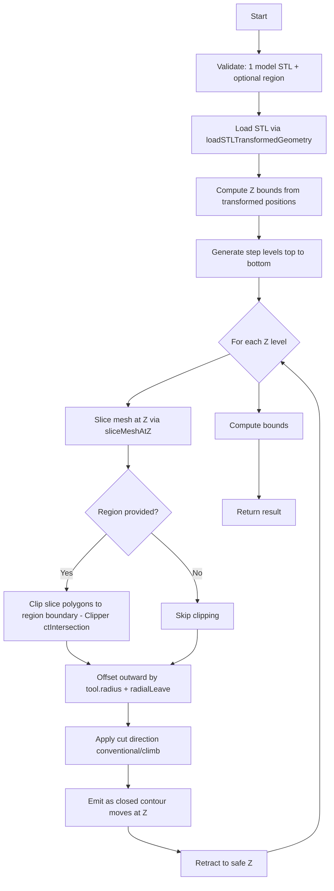

# Finish Surface — 3D Finishing Operation

## 1. Overview

A 3D finishing operation that cleans the walls of a 3D model by following its true surface contour at each step-down level. This complements the Rough Surface operation (which clears the area *between* the region boundary and the model surface) by machining the model walls themselves to the final dimension.

### Key Difference from Rough Surface

| Aspect | Rough Surface | Finish Surface |
|--------|---------------|----------------|
| What it cuts | Area between region boundary and model | The model wall contours themselves |
| Motion | Pocket-style: offset inward from region to model | Contour-following: follows model surface at each Z |
| Stock to leave | Applies radial leave as initial inset | Applies radial leave as **outward** offset from model surface |
| Region | Required (defines outer boundary) | Optional (limits machining area) |

---

## 2. Path Strategies

### 2.1. Contour (Phase 1 — implement first)

At each step-down Z level, the tool follows the model's true cross-section contour, offset outward by `tool.radius + stockToLeaveRadial`.

```
                    ┌─────────────────────┐
                    │   Region boundary    │  (optional — clips the work area)
                    │                     │
                    │   ┌─────────────┐   │
                    │   │  Contour at │   │  <-- tool follows this path
                    │   │  Z=n        │   │      offset outward from model
                    │   │   ┌─────┐   │   │      by tool.radius + finishAllowance
                    │   │   │Model│   │   │
                    │   │   │     │   │   │
                    │   │   └─────┘   │   │
                    │   └─────────────┘   │
                    └─────────────────────┘
```

**Algorithm (per Z level)**:

1. **Slice** the 3D triangle mesh at this Z using the existing custom mesh slicer (`sliceMeshAtZ`)
2. **Clip** (optional): If a region feature is provided, intersect the slice contours with the region boundary using Clipper `ctIntersection`. This limits machining to within the region.
3. **Offset outward** by `tool.radius + stockToLeaveRadial` using ClipperOffset (positive delta)
4. **Apply cut direction** (conventional/climb)
5. **Emit** as closed contour moves at this Z using `cutClosedContours` or `toClosedCutMoves`

**Step levels**: Generated via `generateStepLevels(modelTopZ, modelBottomZ, operation.stepdown)`, same as pocket.

### 2.2. Parallel (Phase 2 — future)

Generates 3D parallel passes where the tool moves along parallel lines in XY and the Z height follows the model surface.

```
   Z ↑
     │    ╱╲    ╱╲
     │   ╱  ╲  ╱  ╲         <-- tool follows surface slope
     │  ╱    ╲╱    ╲
     │ ╱              ╲
     └────────────────────────→ X
       ← parallel passes →
```

**Algorithm**:

1. Generate step levels from top to bottom
2. At each step level, slice the mesh to get cross-section contours
3. For the parallel angle (e.g. 0° = horizontal), generate parallel scanlines across the bounding box
4. For each scanline, find XY intersection points with the cross-section at each Z level
5. Connect adjacent Z-level intersection points to form a 3D zigzag path
6. Optionally: use scanline rotation (like pocket parallel) for alternating directions

---

## 3. Type Definitions

### 3.1. New operation kind

Add `finish_surface` to `OperationKind` in [`src/types/project.ts`](src/types/project.ts:278):

```typescript
export type OperationKind =
  | 'pocket'
  | 'v_carve'
  | 'v_carve_recursive'
  | 'edge_route_inside'
  | 'edge_route_outside'
  | 'surface_clean'
  | 'rough_surface'
  | 'finish_surface'    // NEW
  | 'follow_line'
  | 'drilling'
```

### 3.2. New pattern type

Add `FinishSurfacePattern` to [`src/types/project.ts`](src/types/project.ts:290):

```typescript
export type FinishSurfacePattern = 'contour' | 'parallel'
```

### 3.3. Operation interface changes

The existing [`Operation`](src/types/project.ts:299) interface already has `pocketPattern: PocketPattern` and `pocketAngle: number`. For the finish surface, we can reuse `pocketPattern` for the wall finish path strategy (renamed conceptually to `finishPattern`), or add a separate field.

**Recommendation**: Reuse `pocketPattern` field with a new type union rather than adding a new field, to minimize schema changes. The `finish_surface` operation interprets `pocketPattern` as its path strategy:

| `pocketPattern` value | Finish Surface behavior |
|----------------------|------------------------|
| `'offset'` | Contour strategy (follows model contour at each Z) |
| `'parallel'` | Parallel strategy (zigzag connecting slices) |

The `pocketAngle` field controls the angle for the parallel strategy (0° = horizontal, 90° = vertical).

### 3.4. Target

```typescript
// Required: 1 model feature (STL)
// Optional: 1 region feature (closed profile — limits machining area)
// Validation: exactly 1 model feature, 0 or 1 region features

// Examples:
{ source: 'features', featureIds: ['model-id'] }
{ source: 'features', featureIds: ['model-id', 'region-id'] }
```

---

## 4. Algorithm Detail — Contour Strategy

### 4.1. Entry point

New file: [`src/engine/toolpaths/finishSurface.ts`](src/engine/toolpaths/finishSurface.ts)

```typescript
export function generateFinishSurfaceToolpath(
  project: Project,
  operation: Operation,
): PocketToolpathResult
```

### 4.2. Pseudo-code

```
function generateFinishSurfaceToolpath(project, operation):
  // 1. Validate: exactly 1 model feature (STL), 0 or 1 region features
  // 2. Load STL geometry via loadSTLTransformedGeometry (shared with 3D preview)
  // 3. Compute Z bounds from transformed positions
  // 4. Validate tool, stepdown, stockToLeave

  // 5. Generate step levels from top to bottom
  stepLevels = generateStepLevels(modelTopZ, modelBottomZ, stepdown)

  // 6. Per-level loop
  for each z in stepLevels:
    // a. Slice mesh at Z
    slicePolygons = sliceMeshAtZ(transformedPositions, index, z)

    // b. If region provided, clip slice against region boundary
    if regionFeature:
      slicePolygons = clipPolygonsToRegion(slicePolygons, regionFeature)

    // c. Offset outward by tool.radius + stockToLeaveRadial
    offsetPolgyons = offsetPolygons(slicePolygons, tool.radius + radialLeave)

    // d. Apply cut direction
    contourMoves = applyDirection(offsetPolygons, direction)

    // e. Emit as closed contour at this Z
    for each contour:
      emit closed cut moves at z

  // 7. Return result with bounds + step levels
```

### 4.3. Clipper operations needed

For the contour strategy, we need two Clipper operations:

1. **Clip to region** (when region provided): `ctIntersection` — intersect slice polygons with region boundary
2. **Offset outward**: `ClipperOffset` with positive delta = `tool.radius + radialLeave`

These can be implemented using the existing [`offsetPaths`](src/engine/toolpaths/edge.ts:37) helper from edge.ts and standard Clipper operations.

### 4.4. Reused infrastructure

| Component | Source | Usage |
|-----------|--------|-------|
| `loadSTLTransformedGeometry` | [`csg.ts`](src/engine/csg.ts:252) | Load and transform STL geometry |
| `sliceMeshAtZ` | [`roughSurface.ts`](src/engine/toolpaths/roughSurface.ts:93) | Slice triangle mesh at Z (non-manifold safe) |
| `chainSegments` | [`roughSurface.ts`](src/engine/toolpaths/roughSurface.ts:163) | Chain intersection segments into polygons |
| `generateStepLevels` | [`pocket.ts`](src/engine/toolpaths/pocket.ts:242) | Generate Z step levels |
| `offsetPaths` | [`edge.ts`](src/engine/toolpaths/edge.ts:37) | Clipper offset with positive delta |
| `toClosedCutMoves` | [`pocket.ts`](src/engine/toolpaths/pocket.ts:144) | Convert points to closed contour moves |
| `contourStartPoint` | [`pocket.ts`](src/engine/toolpaths/pocket.ts:139) | Entry point for a contour |
| `transitionToCutEntry` | [`pocket.ts`](src/engine/toolpaths/pocket.ts:212) | Rapid + plunge to entry point |
| `retractToSafe` | [`pocket.ts`](src/engine/toolpaths/pocket.ts:196) | Retract to safe Z |
| `updateBounds` | [`pocket.ts`](src/engine/toolpaths/pocket.ts:280) | Accumulate toolpath bounds |
| `normalizeToolForProject` | [`geometry.ts`](src/engine/toolpaths/geometry.ts:89) | Normalize tool dimensions |
| `getOperationSafeZ` | [`geometry.ts`](src/engine/toolpaths/geometry.ts:173) | Compute safe Z |

---

## 5. Algorithm Detail — Parallel Strategy (Phase 2)

### 5.1. Concept

Instead of following a single contour at each Z level, the parallel strategy:

1. Generates parallel scanlines in XY at a given angle
2. For each scanline, computes intersection points with the model surface at each step-down Z level
3. Connects these points vertically to create a 3D zigzag path

### 5.2. Approach

```
function generateFinishSurfaceParallel(project, operation):
  stepLevels = generateStepLevels(topZ, bottomZ, stepdown)

  // Collect slice contours at each Z level
  slices = []
  for each z in stepLevels:
    slices[z] = sliceMeshAtZ(mesh, z)

  // For each parallel scanline (at angle), find intersection with slices
  angleRad = operation.pocketAngle * PI / 180
  boundingBox = computeBoundingBox(mesh)

  // Generate scanlines across bounding box
  for each scanline at angle:
    points3D = []
    for each z in stepLevels:
      intersections = intersectScanlineWithContours(scanline, slices[z])
      // For each XY intersection, the Z is known from the step level
      points3D.push(...intersections.map(pt => { x: pt.x, y: pt.y, z }))

    // Sort points along scanline and emit as 3D cut moves
    sortAlongScanline(points3D)
    emit open cut moves at each point's Z
```

### 5.3. Implementation notes

- The parallel strategy is significantly more complex than contour
- Requires finding scanline-contour intersections at each Z level
- For Z levels between slices, Z is interpolated linearly between adjacent step levels
- Scallop height control may be needed for smooth surface finish

---

## 6. Files to Create / Modify

### New files

| File | Purpose |
|------|---------|
| [`src/engine/toolpaths/finishSurface.ts`](src/engine/toolpaths/finishSurface.ts) | Finish Surface algorithm implementation |

### Modified files

| File | Changes |
|------|---------|
| [`src/types/project.ts`](src/types/project.ts:278) | Add `finish_surface` to `OperationKind` |
| [`src/store/projectStore.ts`](src/store/projectStore.ts:1449) | Add label, validation (`isOperationTargetValid`), fallback target (`fallbackOperationTarget`), default operation (`defaultOperationForTarget`), skip pass selection |
| [`src/components/cam/CAMPanel.tsx`](src/components/cam/CAMPanel.tsx:255) | Add button label, properties panel entries, pass-selection exclusion |
| [`src/App.tsx`](src/App.tsx:184) | Wire into toolpath dispatch chain |
| [`src/engine/toolpaths/index.ts`](src/engine/toolpaths/index.ts) | Export from `finishSurface.ts` |

---

## 7. UI Layout

### 7.1. Operation button

Add to the operation buttons list in CAMPanel:

```
[Finish surface]
```

### 7.2. Properties panel

When a Finish Surface operation is selected, show:

| Property | Control | Notes |
|----------|---------|-------|
| Target | Feature selector | Shows model + optional region |
| Tool | Tool selector | Standard |
| Stepdown | Length input | Z step-down per pass |
| Stepover | Ratio input | Stepover ratio (for parallel strategy) |
| Path strategy | Select: Contour / Parallel | `pocketPattern` field — show only for this operation kind |
| Angle | Number input | Show only when `pocketPattern === 'parallel'` |
| Cut direction | Select: Conventional / Climb | `cutDirection` |
| Stock to leave radial | Length input | Finish allowance |
| Stock to leave axial | Length input | Axial finish allowance |

### 7.3. Pass selection

The Finish Surface operation should **skip** pass selection (rough/finish) — it is always a finish pass. This is the same behavior as `rough_surface`, `v_carve`, `v_carve_recursive`, `drilling`, and `follow_line`.

Add `finish_surface` to the exclusion list in [`operationSupportsPassSelection`](src/components/cam/CAMPanel.tsx:278).

---

## 8. Implementation Order

### Phase 1: Contour strategy

1. Add `finish_surface` to `OperationKind` type
2. Add validation in `isOperationTargetValid` — requires 1 model (STL), optionally 1 region
3. Add fallback target in `fallbackOperationTarget`
4. Add default operation in `defaultOperationForTarget`
5. Add label in `operationKindLabel` and `operationAddButtonLabel`
6. Skip pass selection in `operationSupportsPassSelection`
7. Add operation button in CAMPanel
8. Show properties in CAMPanel
9. Wire into App.tsx dispatch chain
10. Export from index.ts
11. Implement `generateFinishSurfaceToolpath` in `finishSurface.ts` with contour strategy
12. Verify TypeScript build
13. Test with a cat STL model + optional region

### Phase 2: Parallel strategy

14. Implement parallel strategy algorithm
15. Add angle input to properties panel (conditionally shown)
16. Verify TypeScript build
17. Test

---

## 9. Mermaid Diagram — Contour Strategy Flow


