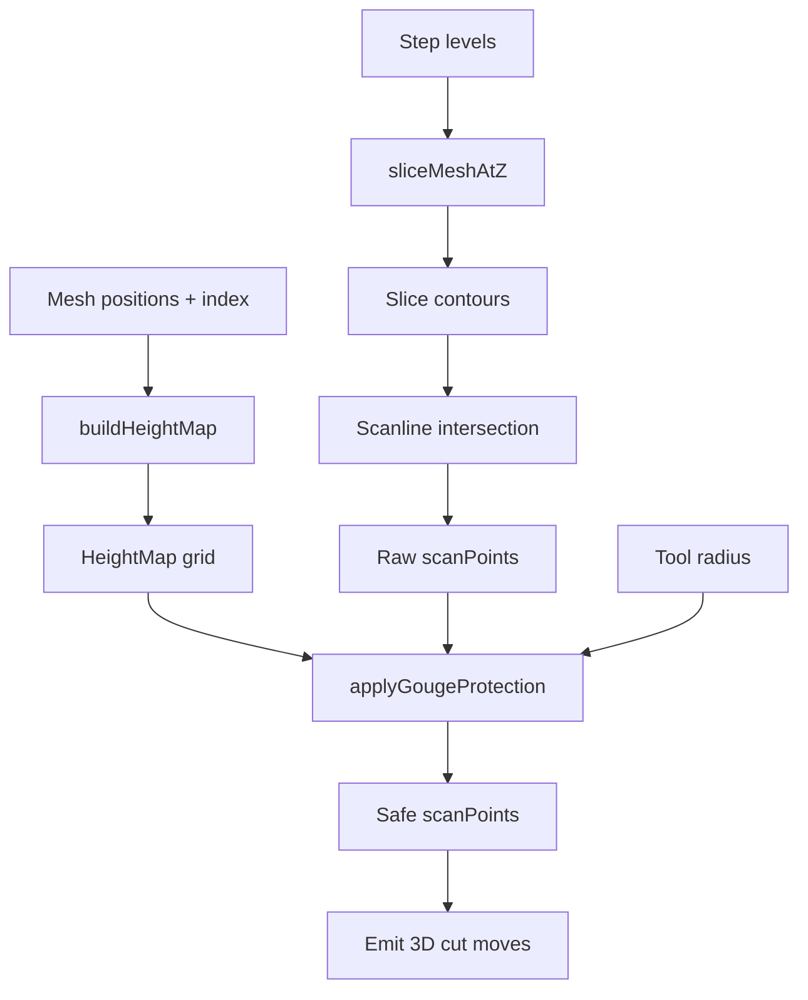

# Finish Surface Parallel — Ball-End Gouge Protection

## 1. Problem

The parallel scanline strategy in [`generateFinishSurfaceParallel`](src/engine/toolpaths/finishSurface.ts:369) generates 3D toolpaths by intersecting the mesh with horizontal planes at each Z level. Each scanline point's Z comes directly from the slice contour — it represents the surface height at that exact XY position.

When a **ball end mill** of radius R follows this path, the tool body extends **horizontally** by R. In a narrow valley (width < 2R), the tool tip reaches the valley floor, but the tool body collides with the valley walls:

```
Surface cross-section along scanline:
   __               __
  /  \             /  \
 /    \___________/    \
/        ^^^ narrow valley
         tool center here
```

The scanline says cut to depth Z, but the tool physically can't fit. Result: gouged material.

## 2. Solution: Height Map + Neighborhood Constraint

### 2.1 Height Map

A regular 2D grid of surface Z values across the model's XY bounding box. Each cell stores the topmost surface height at that XY position.

```
Cell size: tool_radius / 3  (e.g., 1mm for a 3mm ball end mill)
Memory: bounding_box_area / cell_size² × 4 bytes
  e.g., 100×100mm with 1mm cells = 10,000 floats = 40KB
```

### 2.2 Ball-End Constraint

For a scanline point P = (x, y) with surface height z_s(P) and ball end mill radius R:

```
For each neighboring grid cell Q within distance d ≤ R of P:
  Surface height at Q = z_s(Q)
  Tool body at Q's XY extends to:  z_tip + R - sqrt(R² - d²)
  No-gouge constraint:             z_tip + R - sqrt(R² - d²) ≥ z_s(Q)
  Therefore safe z_tip ≥ z_s(Q) - R + sqrt(R² - d²)

Final safe z_tip(P) = max over Q within R of [z_s(Q) - R + sqrt(R² - d²)]
```

This raises the tool tip in narrow valleys where neighboring surface points are higher than the tool body can clear.

### 2.3 Visual

```
Height map (top view):
┌─────────────────────────┐
│  high   high    high    │
│  high  medium  high     │  ← valley visible as lower-Z cells
│  high    Z↓    high     │     surrounded by higher-Z cells
│  high  medium  high     │
│  high   high    high    │
└─────────────────────────┘

For scanline point at valley center (Z↓):
  Neighbors within radius R → all have higher Z
  Constraint → raise Z so tool clears all neighbors
```

## 3. Implementation

All changes in [`src/engine/toolpaths/finishSurface.ts`](src/engine/toolpaths/finishSurface.ts).

### 3.1 New Function: `buildHeightMap`

```typescript
interface HeightMap {
  data: Float32Array        // row-major grid of Z values
  width: number             // cells in X
  height: number            // cells in Y
  originX: number           // world X of cell [0][0]
  originY: number           // world Y of cell [0][0]
  cellSize: number          // grid resolution
}

function buildHeightMap(
  positions: Float32Array,  // transformed vertex positions
  index: Uint32Array,       // triangle indices
  bbox: { minX: number; maxX: number; minY: number; maxY: number },
  cellSize: number,         // e.g., tool.radius / 3
): HeightMap
```

**Algorithm**:
1. Compute grid dimensions from bbox and cellSize
2. Allocate `data = new Float32Array(width * height)` initialized to `-Infinity`
3. For each triangle `(i0, i1, i2)`:
   a. Get vertices `v0, v1, v2` from `positions`
   b. Compute triangle's XY bounding box in grid coordinates
   c. For each grid cell in that bounding box:
      - Compute cell center `(cx, cy)`
      - Test if `(cx, cy)` is inside the triangle using barycentric coordinates
      - If inside, compute interpolated Z: `z = α·v0.z + β·v1.z + γ·v2.z`
      - `data[row * width + col] = max(current, z)`
4. Return the HeightMap

**Optimization**: For large meshes (>50K triangles), this could be moved to a worker. For initial implementation, run synchronously — the grid is coarse enough (tool_radius/3) to be fast.

### 3.2 New Function: `applyGougeProtection`

```typescript
function applyGougeProtection(
  scanPoints: Array<{ x: number; y: number; z: number; rotX: number }>,
  heightMap: HeightMap,
  toolRadius: number,
): Array<{ x: number; y: number; z: number; rotX: number }>
```

**Algorithm**:
1. Compute `neighborRadius = toolRadius` (check full tool radius)
2. Compute `neighborCells = ceil(neighborRadius / heightMap.cellSize)`
3. For each scanline point P:
   a. Determine P's grid cell `(col, row)`
   b. Compute current `safeZ = P.z` (at minimum, don't go deeper than surface)
   c. For each neighbor cell `(nc, nr)` within `neighborCells`:
      - Compute distance `d = |cellCenter(nc, nr) - P.xy|`
      - If `d > toolRadius`, skip
      - Get surface height `h = heightMap.data[nr * width + nc]`
      - If `h === -Infinity`, skip (no surface at this cell)
      - Compute constraint: `constrained = h - toolRadius + Math.sqrt(toolRadius * toolRadius - d * d)`
      - `safeZ = Math.max(safeZ, constrained)`
   d. Set `P.z = safeZ`
4. Return updated scanPoints

### 3.3 Integration in `generateFinishSurfaceParallel`

At line ~458 (after scanPoints are built and sorted, before emitting cut moves):

```typescript
// Before: emit cut moves directly
// After: apply gouge protection first

if (scanPoints.length >= 2) {
  if (tool.type === 'ball_nose' || tool.type === 'ball') {  // if we have tool type info
    const heightMap = buildHeightMap(transformedPos, index, bbox, tool.radius / 3)
    scanPoints = applyGougeProtection(scanPoints, heightMap, tool.radius)
  }
}
```

**Note on tool type**: The `NormalizedTool` type may not include a `type` field. Instead, we can check if the operation tool is available and inspect the original `toolRecord.type`. For safety, apply the gouge protection regardless of tool type — it only constrains Z upward (never deeper), so for flat end mills it's conservative but never destructive.

**Caching**: The height map should be built once per operation, not once per scanline. Move the build outside the scanline loop.

### 3.4 Modified Flow

```
generateFinishSurfaceParallel:
  ┌─ slice mesh at each Z level (sliceMap) ──────────────────┐
  │  ┌─ compute XY bounding box ───────────────────────────┐ │
  │  │  ┌─ build height map (NEW) ──────────────────────┐  │ │
  │  │  │  ┌─ for each scanline: ───────────────────┐   │  │ │
  │  │  │  │  collect intersection points            │   │  │ │
  │  │  │  │  sort by rotX                           │   │  │ │
  │  │  │  │  apply gouge protection (NEW)           │   │  │ │
  │  │  │  │  emit 3D cut moves                      │   │  │ │
  │  │  │  └─────────────────────────────────────────┘   │  │ │
  │  │  └────────────────────────────────────────────────┘  │ │
  │  └─────────────────────────────────────────────────────┘ │
  └──────────────────────────────────────────────────────────┘
```

## 4. Edge Cases

| Situation | Behavior |
|-----------|----------|
| Flat surface | All neighbors at same Z → no constraint change → Z unchanged |
| Bulge/hill | Neighbors higher → constraint may raise Z → tool rides over bulge (desired) |
| Narrow valley | Neighbors much higher → Z raised → tool doesn't plunge into valley (desired) |
| Steep cliff edge | Neighbors outside model → `h = -Infinity` → skipped → no constraint |
| No surface near point | All neighbors `-Infinity` → Z unchanged |
| Ball end mill | Full gouge protection active |
| Flat end mill | Gouge protection still applies (conservative for non-ball tools) |

## 5. Files Modified

| File | Change |
|------|--------|
| [`src/engine/toolpaths/finishSurface.ts`](src/engine/toolpaths/finishSurface.ts) | Add `buildHeightMap`, `applyGougeProtection`, wire into `generateFinishSurfaceParallel` |

## 6. Mermaid — Data Flow


