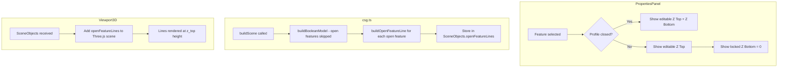

# Open Feature (Polyline) 3D Display — Implementation Plan

## Problem

Open features (sketch profiles with `closed: false`) are not rendered properly in the 3D viewport. Two issues:

1. **Properties Panel**: Z Bottom is editable for open features, but it has no meaning — open features are purely 2D lines at a single Z height. Z Bottom should be locked to `0` and non-editable.

2. **3D Viewport**: Open features are silently skipped by the boolean model (`buildFeatureSolid` returns `null` for `!profile.closed`). They don't appear at all in the 3D scene. They should be displayed as lines at their Z Top height.

## Current Code Analysis

### Data Model ([`src/types/project.ts`](src/types/project.ts:236))
- [`SketchFeature`](src/types/project.ts:236) has `z_top` and `z_bottom` as `DimensionRef`
- Open features are created with `closed: false` on [`SketchProfile`](src/types/project.ts:57)
- No existing field indicates "this is an open/polyline feature" — detection is via `!profile.closed`

### Properties Panel ([`src/components/feature-tree/PropertiesPanel.tsx`](src/components/feature-tree/PropertiesPanel.tsx:1285))
- Single feature Z Top/Z Bottom rendering: lines 1285-1306
- Multi-select Z Top/Z Bottom rendering: lines 1119-1142
- Open feature detection: use `selectedFeature.sketch.profile.closed` or `featureHasClosedGeometry()` from [`src/text/index.ts`](src/text/index.ts:671)
- No current differentiation between open and closed features in Z field rendering

### 3D CSG Engine ([`src/engine/csg.ts`](src/engine/csg.ts))
- [`buildFeatureSolid`](src/engine/csg.ts:642): returns `null` at line 714 if `!feature.sketch.profile.closed` — open features are excluded from boolean model
- [`buildFeatureMesh`](src/engine/csg.ts:409): uses `profileToShape()` + `ExtrudeGeometry` — this works for closed profiles but produces incorrect geometry for open profiles
- [`buildScene`](src/engine/csg.ts:833): only creates individual meshes for STL/region features explicitly; falls back only if boolean model fails
- [`SceneObjects`](src/engine/csg.ts:824) interface has no field for line objects

### 3D Viewport ([`src/components/viewport3d/Viewport3D.tsx`](src/components/viewport3d/Viewport3D.tsx))
- Renders `featureMeshes` from `SceneObjects` at line 891
- No rendering of any line objects for non-closed features

## Implementation Steps

### Step 1: Properties Panel — Lock Z Bottom for Open Features

**File**: [`src/components/feature-tree/PropertiesPanel.tsx`](src/components/feature-tree/PropertiesPanel.tsx)

#### 1a. Single feature edit (around line 1283-1307)

Add a check: if the selected feature has an open profile (`!selectedFeature.sketch.profile.closed`), render the Z Bottom field as a disabled/read-only field always showing `0`, similar to how clamps render Z Bottom at lines 989-999.

Pseudo-change:
```
// Before the Z Top/Z Bottom section (line 1283):
const isOpenProfile = !selectedFeature.sketch.profile.closed

// Z Bottom field (line 1296-1305):
{isOpenProfile ? (
  <label className="properties-field">
    <span>Z Bottom</span>
    <DraftNumberInput
      key={`feature-zbottom-open-${selectedFeature.id}`}
      value={0}
      units={units}
      min={0}
      max={0}
      onCommit={() => {}}  // no-op
    />
  </label>
) : (
  // existing editable Z Bottom
)}
```

Also, when the feature is an open profile, ensure the Z Bottom value in the store is always `0` (it may already be if created via the polyline tool, but enforce it).

#### 1b. Multi-edit (around line 1117-1142)

Filter open features out of the Z Bottom multi-edit or show a mixed-state locked field. Open features' Z Bottom is always `0`, so they should not participate in the multi-edit Z Bottom control.

Add a filter:
```
const selectedClosedFeatures = selectedZEditableFeatures.filter(
  (f) => f.sketch.profile.closed
)
const selectedOpenFeatures = selectedZEditableFeatures.filter(
  (f) => !f.sketch.profile.closed
)
```

If there's a mix, show a note or render the open features' Z Bottom as locked at 0 separately.

### Step 2: CSG — Build Line Geometry for Open Features

**File**: [`src/engine/csg.ts`](src/engine/csg.ts)

#### 2a. Add `buildOpenFeatureLine` function

Create a new exported function that converts an open profile's vertices into a [`THREE.Line`](https://threejs.org/docs/#api/en/objects/Line) positioned at the feature's Z Top:

```
export function buildOpenFeatureLine(
  feature: SketchFeature,
  project: Project,
  selected = false,
  hovered = false,
): THREE.Line {
  const profile = feature.sketch.profile
  const zTop = resolveDimension(feature.z_top, project)
  
  // Collect all vertices: start point + all segment endpoints
  const vertices: number[] = [profile.start.x, 0, profile.start.y]
  for (const seg of profile.segments) {
    // For arcs/beziers, subdivide into line segments for accurate 3D representation
    const points = subdivideSegment(profile.start, seg)
    for (const pt of points) {
      vertices.push(pt.x, 0, pt.y)
    }
  }
  
  // Create THREE.BufferGeometry
  const geometry = new THREE.BufferGeometry()
  geometry.setAttribute('position', new THREE.Float32BufferAttribute(vertices, 3))
  
  // Position at z_top by translating Y axis (which is Z in Three.js convention after rotation)
  geometry.translate(0, zTop, 0)
  
  const color = selected ? 0xffaa00 : hovered ? 0x44aaff : 0x3366cc
  const material = new THREE.LineBasicMaterial({ color })
  
  return new THREE.Line(geometry, material)
}
```

**Note on coordinate system**: In [`buildFeatureMesh`](src/engine/csg.ts:478), the geometry is rotated `-PI/2` around X and translated by `yStart` (which is `min(zTop, zBottom)`). The Three.js Y axis maps to the world Z axis. So for lines at Z Top, we should translate by `zTop` on the Y axis after the X rotation, matching the convention used by `buildFeatureMesh`.

#### 2b. Update `SceneObjects` interface

Add a field for open feature lines:

```
export interface SceneObjects {
  stockMesh: THREE.Mesh
  stockWireframe: THREE.LineSegments
  modelMesh: THREE.Mesh | null
  featureMeshes: Map<string, THREE.Mesh>
  openFeatureLines: Map<string, THREE.Line>   // NEW
  tabMeshes: Map<string, THREE.Mesh>
  clampMeshes: Map<string, THREE.Mesh>
}
```

#### 2c. Update `buildScene` function

After the existing feature-mesh loop (around line 873), add logic to build line geometry for open features:

```
// Build line representations for open features
const openFeatureLines = new Map<string, THREE.Line>()
for (const feature of visibleFeatures) {
  if (!feature.sketch.profile.closed) {
    openFeatureLines.set(
      feature.id,
      buildOpenFeatureLine(feature, project)
    )
  }
}
```

Include `openFeatureLines` in the return value.

### Step 3: Viewport3D — Render Open Feature Lines

**File**: [`src/components/viewport3d/Viewport3D.tsx`](src/components/viewport3d/Viewport3D.tsx)

#### 3a. After the feature meshes are added to the scene (after line 894), add the open feature lines:

```
for (const openLine of nextSceneObjects.openFeatureLines.values()) {
  scene.add(openLine)
  objectsRef.current.push(openLine)
}
```

#### 3b. Update cleanup logic to handle `THREE.Line` objects

The existing `clearRenderedObjects` function (around line 799) already handles `THREE.Line` and `THREE.LineSegments` via the `instanceof` check. The open feature lines will be `THREE.Line` instances, so they should be cleaned up automatically.

### Step 4: Handle Edge Cases

1. **Parametric Z Top**: If `z_top` is a `DimensionRef` (string key), use `resolveDimension` to get the numeric value.
2. **Text/Composite features**: Use [`expandFeatureGeometry`](src/text/index.ts:693) and check each expanded profile. Text features (skeleton style) produce open profiles too, so they should also get line rendering.
3. **Boolean model interaction**: Open features should remain excluded from `buildBooleanModel` (the check at line 714 is correct). They are visual-only in the 3D view.
4. **Arc and Bezier segments**: Need proper subdivision into line segments for accurate 3D line rendering. Reuse the existing [`profileToPolygon`](src/engine/csg.ts:117) function which already handles subdivision of arcs and beziers into polyline points.

## Files Modified

| File | Changes |
|------|---------|
| [`src/engine/csg.ts`](src/engine/csg.ts) | Add `buildOpenFeatureLine()`, update `SceneObjects`, update `buildScene()` |
| [`src/components/feature-tree/PropertiesPanel.tsx`](src/components/feature-tree/PropertiesPanel.tsx) | Lock Z Bottom to 0 for open features in single-edit and multi-edit |
| [`src/components/viewport3d/Viewport3D.tsx`](src/components/viewport3d/Viewport3D.tsx) | Add open feature lines to scene rendering |

## Diagram



## Testing Notes

- Create an open polyline feature. Verify Z Bottom is locked at 0 in Properties Panel.
- Verify the polyline appears as a line in the 3D view at its Z Top level.
- Verify closed features still show as solid extrusions (no regression).
- Verify multi-select with mixed open/closed features handles Z Bottom correctly.
- Verify text features with skeleton style (which also have open profiles) render correctly.
- Verify arc and bezier segments within open profiles are properly subdivided.
